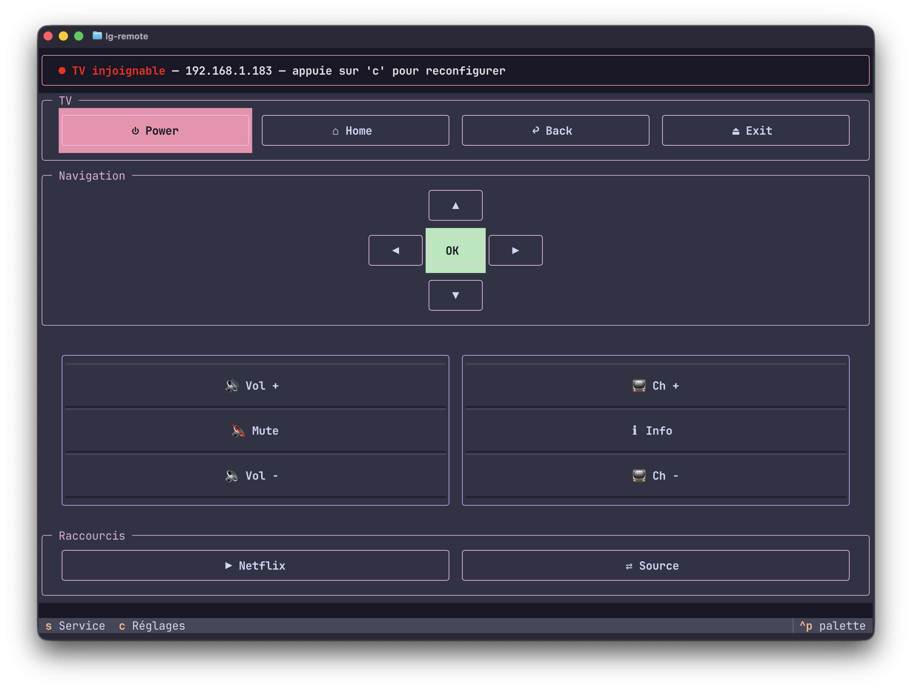

# lg-remote

Télécommande TUI (Textual) pour une TV LG webOS sur le réseau local, basée
sur [`bscpylgtv`](https://github.com/chros73/bscpylgtv).



## ⚠ Phase bêta

Ce projet est en phase bêta. Au lancement, l'app affiche un écran
d'avertissement à valider avant de continuer : le menu **Service** et les
**commandes protégées** (IN-STOP, NVM, Factory Reset, White Balance...)
peuvent avoir des conséquences **irréversibles** sur la TV (dérèglement ou
dommage du calibrage de la dalle) si tu ne sais pas précisément ce qu'ils
font. N'utilise ces fonctions que si tu es certain·e de leur effet — voir
aussi "Limitations connues" plus bas.

## Installation

Ce projet s'installe dans un environnement virtuel Python (venv), pour ne
pas mélanger ses dépendances avec le reste de ton système.

```bash
# Depuis la racine du projet
python3 -m venv .venv
source .venv/bin/activate        # macOS / Linux
# .venv\Scripts\Activate.ps1     # Windows PowerShell

pip install --upgrade pip        # une venv fraîche embarque parfois un pip
                                  # trop ancien pour l'install editable
pip install -e .
```

Le venv doit être **réactivé à chaque nouvelle session de terminal** avant de
lancer l'app :

```bash
source .venv/bin/activate
lg-remote
```

Pour sortir du venv :

```bash
deactivate
```

## Premier lancement

Au premier lancement, aucun fichier de config n'existe encore : `lg-remote`
affiche directement l'écran de configuration.

1. Renseigne l'IP de la TV (Réglages → Tous les réglages → Général →
   Réseau, sur la TV).
2. Clique sur "Tester la connexion".
3. Si c'est la première fois que cette app se connecte à la TV, un popup
   d'autorisation apparaît sur l'écran de la TV — accepte-le. L'app attend
   jusqu'à 60 secondes.
4. Une fois connecté, l'IP est enregistrée dans
   `~/.config/lg-remote/config.toml` et l'app bascule sur l'écran de
   télécommande.

**Astuce réseau :** fais une réservation DHCP pour la TV sur ton routeur,
pour que son IP ne change jamais — sinon il faudra reconfigurer l'app à
chaque changement d'IP.

## Utilisation

- `lg-remote` : lance l'app (écran de télécommande si déjà configuré).
- `lg-remote --setup` : relance l'écran de configuration (utile si l'IP de
  la TV a changé).
- Depuis l'écran de télécommande : `s` ouvre le menu Service (avec
  avertissement), `c` ouvre les Réglages (dont "Reconfigurer l'IP").
- Flèches, Entrée, `+`/`-`, `m` : navigation, OK, volume, muet — en plus du
  clic souris.
- Pavé numérique (0-9) : affiché par défaut sous la navigation. Se
  désactive depuis Réglages ("Pavé numérique (0-9)"), à réactiver de la
  même façon.
- Chaque écran affiche un pied de page (Footer) listant ses raccourcis
  clavier disponibles.
- Thème : [Catppuccin Mocha](https://catppuccin.com/), un thème intégré à
  Textual (`app.theme`).

## Limitations connues

- **Allumage à distance** : `bscpylgtv` expose une méthode `power_on()`,
  mais sa propre documentation précise qu'elle "ne fonctionne plus sur les
  versions récentes de webOS". Le bouton Power de cette app ne garantit
  fiablement que l'extinction.
- **Zone "Commandes protégées"** (IN-STOP, NVM, Factory Reset, White
  Balance) : ces boutons existent dans les Réglages mais restent
  **désactivés**. Leurs payloads exacts n'ont pas été vérifiés contre du
  matériel réel — les activer sans confirmation externe pourrait dérégler
  le calibrage de l'écran. Idem pour le menu Service (IN-START, EZ-ADJUST) :
  ce sont des menus d'usine, pas des réglages utilisateur normaux — voir
  "Phase bêta" plus haut.
